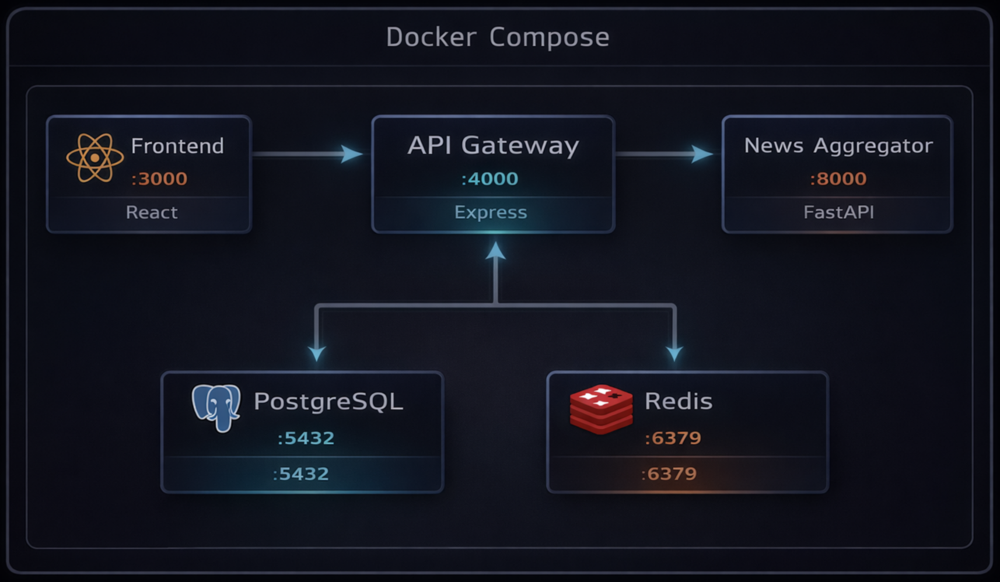

# Cybersecurity DEFCON dashboard

A self-hosted dashboard that aggregates cybersecurity news from RSS feeds, deduplicates articles, scores them on a DEFCON-style threat scale (1–5), and presents everything through a real-time web interface.

## Screenshots

<div align="center">

**Login screen**


**Dashboard**


</div>

## Architecture

<div align="center">



</div>

### Services

| Service | Stack | Port | Purpose |
|---|---|---|---|
| **Frontend** | React 18 + Vite + Tailwind, served by Nginx | `:3000` | Dashboard UI with DEFCON gauge, article feed, widgets |
| **API Gateway** | Node.js 20 + Express | `:4000` | REST API for articles, DEFCON status, read state, admin triggers |
| **News Aggregator** | Python 3.12 + FastAPI + APScheduler | `:8000` | Fetches RSS feeds, deduplicates, scores, stores articles |
| **PostgreSQL 16** | postgres:16-alpine | `:5432` | Articles, read state, DEFCON history, dedup audit log |
| **Redis 7** | redis:7-alpine | `:6379` | Deduplication fingerprints and recent title tracking |

### Networks

**Local / dev**

- internal. PostgreSQL and Redis are isolated; only accessible by the aggregator and API gateway
- external. News aggregator, API gateway, and frontend

**Production**

- defcon-internal. PostgreSQL, Redis, news aggregator, and API gateway (isolated bridge)
- traefik. API gateway and frontend; shared with the Traefik reverse proxy, which uses Docker labels on this network to discover and route traffic

The API gateway joins both production networks: `defcon-internal` to reach PostgreSQL, Redis, and the aggregator, and `traefik` so the frontend Nginx proxy can reach it at `http://api-gateway:4000`.

## Quick start (local / dev)

```bash
cp .env.example .env        # Edit POSTGRES_PASSWORD and AUTH_SECRET
podman compose up -d        # or: docker compose up -d
```

The dashboard is available at **http://localhost:3000**. The aggregator fetches articles on startup and then every 60 minutes.

Clean reset (drops all data):

```bash
podman compose down -v && podman compose up --build -d
```

## Production deployment (OpenTofu)

### Requirements

- OpenTofu 1.6+
- Target server with Docker installed
- Deploy user in the `docker` group
- SSH access to the target server
- DNS A record pointing your domain to the server IP

### DNS

Before running `tofu apply`, your domain must resolve to the server:

```bash
# Create an A record: defcon.example.com → your server IP
# Then verify propagation:
dig +short defcon.example.com @1.1.1.1
```

Let's Encrypt validates DNS during certificate issuance. Repeated failures trigger a temporary ban, so confirm the record resolves before applying.

### Secrets & State

Postgres password and JWT signing key are auto-generated by OpenTofu on first apply. They are written to `/opt/defcon-dashboard/.env` on the server (permissions: `0600`) and stored in `terraform.tfstate`.

The state file contains all secrets in plaintext. It is gitignored — treat it like a password store.

> Optional (teams/CI): Use remote state with encryption (e.g. S3 with server-side encryption or Terraform Cloud) so the state file never sits on a workstation.

### Quick start

```bash
cd tofu/
cp terraform.tfvars.example terraform.tfvars
# Edit terraform.tfvars — see comments inside
```

Get it up and running:

```bash
tofu init
tofu validate
tofu plan
tofu apply
```

Minimum required values in `terraform.tfvars`:

| Variable | Example |
|---|---|
| `docker_host` | `ssh://deploy@your-server.example.com` |
| `remote_host` | `deploy@your-server.example.com` |
| `admin_email` | `you@example.com` |
| `defcon_domain` | `defcon.example.com` |
| `defcon_admin_password` | `a-strong-password` |

### Traefik

By default, `deploy_traefik = false`. The dashboard assumes Traefik is already running on the server (e.g. deployed by a shared gateway stack). The `traefik` Docker network must already exist; the dashboard containers join it automatically.

To let this stack deploy its own Traefik instance instead, set:

```hcl
deploy_traefik = true
```

### Retrieve credentials

```bash
tofu output -json defcon_secrets | jq
```

### Update images

Use `-replace` to rebuild and redeploy a container. Docker volumes (your data) are preserved.

```bash
tofu apply -replace='module.defcon.docker_image.news_aggregator'
tofu apply -replace='module.defcon.docker_image.api_gateway'
tofu apply -replace='module.defcon.docker_image.frontend'
```

Do not use `tofu destroy` to update images; it removes volumes and permanently deletes all data.

### Backup

Volume names use `defcon_name_prefix` (default: `defcon`):

```bash
# PostgreSQL data
docker run --rm -v defcon-postgres-data:/data -v $(pwd):/backup \
  alpine tar -czf /backup/postgres-backup.tar.gz -C /data .

# Redis data
docker run --rm -v defcon-redis-data:/data -v $(pwd):/backup \
  alpine tar -czf /backup/redis-backup.tar.gz -C /data .
```

### Destroy

Warning: This removes all containers and volumes. All data is permanently deleted.

```bash
tofu destroy
```

## News sources

| Source | Feed URL |
|---|---|
| Bleeping Computer | `https://www.bleepingcomputer.com/feed/` |
| Dark Reading | `https://www.darkreading.com/rss.xml` |
| Help Net Security | `https://www.helpnetsecurity.com/feed/` |
| Security Week | `https://feeds.feedburner.com/Securityweek` |
| The Hacker News | `https://feeds.feedburner.com/TheHackersNews` |

## Data pipeline

### 1. Fetch

Each RSS feed is fetched via `httpx` and parsed with `feedparser`. Raw articles are normalized into a `RawArticle` dataclass.

### 2. Deduplicate (two layers)

| Layer | Method | Threshold |
|---|---|---|
| L1 Fast | SHA-256 fingerprint of normalized title tokens | Exact match via Redis SET |
| L2 Semantic | Jaccard token overlap + TF-IDF cosine similarity (scikit-learn) | Jaccard >= 0.35, cosine >= 0.55 |

Temporal conflicts (different months/years in titles) are never flagged as duplicates. Cross-feed duplicates are caught within a batch before Redis state is updated.

### 3. Score (DEFCON 0–100)

Each article gets a composite score from four equally weighted dimensions (25 points each):

| Dimension | Logic |
|---|---|
| **Volume** | New articles in the last hour / 12 |
| **CVE Severity** | CVSS scores extracted from text, or inferred from severity keywords |
| **Impact** | Regex scan for: millions affected, critical infrastructure, active exploitation, large breaches |
| **Keywords** | 3-tier threat vocabulary: tier 1 (+5), tier 2 (+3), tier 3 (+1) |

The global DEFCON level is computed from the same dimensions across the recent article window:

| Score | Level | Label | Color |
|---|---|---|---|
| 0–19 | 1 | LOW | Green |
| 20–39 | 2 | GUARDED | Blue |
| 40–59 | 3 | ELEVATED | Amber |
| 60–79 | 4 | HIGH | Orange |
| 80–100 | 5 | CRITICAL | Red |

### 4. Store

Articles are upserted into PostgreSQL. Old articles are trimmed to keep 200 total / 15 per source.

## API endpoints

All public routes are prefixed with `/api/v1/`.

| Method | Path | Description |
|---|---|---|
| `GET` | `/articles` | List articles (`limit`, `offset`, `source`, `unread_only`) |
| `PATCH` | `/articles/:id/read` | Mark article read/unread (`{ is_read: bool }`) |
| `PATCH` | `/articles/read-all` | Mark all articles as read for this session |
| `GET` | `/defcon` | Current DEFCON status (score, level, trend, factors) |
| `GET` | `/defcon/history` | Score history (`hours` param, max 168) |
| `POST` | `/admin/refresh` | Trigger a manual fetch cycle (rate-limited) |
| `GET` | `/health` | Health check (PostgreSQL + Redis + aggregator) |

Session-based read state is managed via the `X-Session-ID` header (auto-generated UUID persisted in localStorage).

## Database schema

| Table | Purpose |
|---|---|
| `articles` | Core article store with source, DEFCON score, categories |
| `article_read_state` | Per-session read/unread tracking |
| `defcon_history` | Time-series of computed DEFCON scores with contributing factors |
| `dedup_log` | Audit log of duplicate detection |
| `last_refresh` | Singleton tracking the last refresh timestamp |

## Frontend widgets

| Widget | Description |
|---|---|
| DEFCON Gauge | Circular gauge with current threat level and history sparkline |
| Threat Indicators | Score, level, trend, article count |
| Severity Breakdown | Stacked bar showing article count per DEFCON level |
| Top Threats | 5 highest-scoring articles as clickable links |
| Sources | Per-source article counts |
| Source Distribution | Donut chart of article share per source |
| Trending Keywords | Most frequent threat terms across articles |
| Recent CVEs | CVE IDs extracted from article text, linking to NVD |

## Environment variables

| Variable | Used By | Description |
|---|---|---|
| `POSTGRES_PASSWORD` | PostgreSQL | Database password |
| `CORS_ORIGIN` | API Gateway | Allowed browser origin (default: `http://localhost:3000`) |
| `VITE_API_BASE_URL` | Frontend | API URL baked in at build time (default: `http://localhost:4000`) |
| `AUTH_SECRET` | API Gateway | JWT signing key |
| `ADMIN_PASSWORD` | API Gateway | Dashboard login password |
| `FETCH_INTERVAL_MINUTES` | Aggregator | Scheduler interval in minutes (default: `60`) |
| `LOG_LEVEL` | Aggregator | Python logging level (default: `INFO`) |
